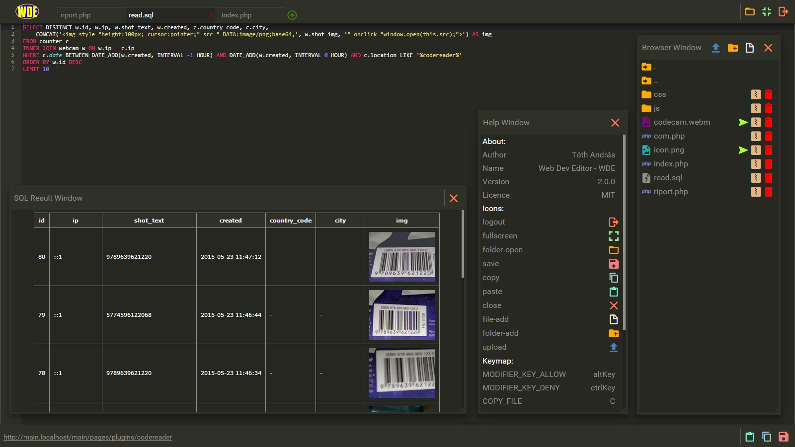

Web Dev Editor
=============

Web Dev Editor / [WDE] / is a Developer text editor for a PHP based  web server.

- Very simple usage
- Some importan options
- Quick implementation
- Multiple users
  
Each user can be assigned:
 
- User name
- Password 
- Path to library for editing allowed

[WDE] - Online Demo 
[Video] - Short Video demo



Version
----
2.0.0 beta

- Removed ACE source from this repo
- Added PHP, Javascript procedures. This Running once at the first launch. 
    It is Download and decompress ACE source from GitHub repo.
- Replaced PNG icons to Icon-Fonts
- Util.js modified
- Some invisible modification

Version
----
1.4.0 beta

- Add new function, Create zip file from file or folder
- Some invisible modification

Version
----
1.3.0 beta

- Scalable windows
- Some invisible modification - refactor etc.

Version
----
1.2.0 beta

- Add SQL testing (Left Alt+R execute SQL query)
- Add db connection options to config.php
- Include SqlFuncProc php class modified version
- some minor modification

2015-04-10

Version
----
1.0.0 beta

Compatibility - tested
----
- IE 10 or above
- Chrome 
- Firefox

Requirements
----
- PHP Web server 5.5 or above

Installation
----
- Copy whole folder (editor) to your web server.
- Fill the config.php with yours details .

Usage
----
- Check out the help on the popup window after login
- Check out [ACE] editor options 

config.php - users, passwords, paths configurations
--------------
```sh
<?php
class Users
{
    // user_password: password_hash('user_password', PASSWORD_DEFAULT);
    private $users = array(
                'user_name' => array(
                    'password' => 'user_password',
                    'path' => 'path to the allowed folder',
                    'SQL' => array(
                        'conn' => 'mysql:host=YOUR_HOST;dbname=YOUR_DBNAME;charset=utf8',
                    //  'conn' => 'sqlsrv:Server=YOUR_SERVERNAME;Database=YOUR_DBNAME',
                        'user' => 'DB_USER',
                        'pass' => 'DB_USER_PASSWORD'
                    )
                )
                // More users -> 
            );

?>
```

editor.js
--------------
```sh
/* key configurations (LEFT ALT) */
var keys = (function() {
    return {
        MODIFIER_KEY_ALLOW: 'altKey',
        MODIFIER_KEY_DENY: 'ctrlKey',
        COPY_FILE: 'C'.charCodeAt(0),
        PASTE_FILE: 'V'.charCodeAt(0),
        SAVE_FILE: 'S'.charCodeAt(0),
        TOGGLE_BROWSE_DIALOG: 'O'.charCodeAt(0),
        NEXT_TAB: 'D'.charCodeAt(0),
        PREV_TAB: 'A'.charCodeAt(0),
        CLOSE_TAB: 'Q'.charCodeAt(0),
        ADD_NEW_TAB: 'N'.charCodeAt(0),
        TOGGLE_HELP_WINDOW: 'H'.charCodeAt(0),
        EXECUTE_SQL: 'R'.charCodeAt(0)
    };
})();

/* Execute Editor */
WDE.Init('ace-theme', 'path to the allowed folder');

```

Used plugins, frameworks etc:
----
- [ACE] High performance code editor

License
----
MIT
Author: Tóth András
---
http://atandrastoth.co.uk/

2015-04-01
[Video]:http://atandrastoth.co.uk/main/pages/plugins/webeditor/
[WDE]:http://editor.atandrastoth.co.uk/
[ACE]:http://ace.c9.io/
